# SoulsWed — Full Project Analysis

> **India's premium wedding marketplace** for venues, vendors, and destination weddings.

---

## 1. Project Overview

| Property | Value |
|---|---|
| **Framework** | Next.js 16.2.6 (App Router) |
| **Language** | TypeScript 5.x |
| **React** | 19.2.4 |
| **Styling** | Tailwind CSS 4 + custom CSS design system |
| **UI Kit** | shadcn/ui (radix-nova style) |
| **Database** | MongoDB via Mongoose 9.6 |
| **Auth** | Custom cookie-based (PBKDF2 password hashing) |
| **Animations** | Framer Motion 12.40 |
| **State** | Zustand 5.0 (installed, not yet used) |
| **Icons** | Lucide React |
| **Total LoC** | ~8,600 lines (TS/TSX/CSS) |

---

## 2. Architecture Diagram

```mermaid
graph TB
    subgraph "Frontend (Next.js App Router)"
        A["/ (Homepage)"] --> H["HeroSection"]
        A --> W["WeddingCategoriesSection"]
        A --> FV["FeaturedVenues"]
        A --> PH["PhotographersSection"]
        A --> MA["MakeupArtistsSection"]
        A --> DP["DecoratorsPlannersSection"]
        A --> TS["TestimonialsSection"]

        V["/venues"] --> VF["VenueFilterBar"]
        V --> VC["VenueCard"]
        VD["/venues/[id]"] --> VH["VenueHero"]
        VD --> VG["VenueGallery"]
        VD --> VS["VenueSidebar"]
        VD --> VR["VenueReviews"]
        VD --> SV["SimilarVenues"]

        L["/login"] --> AL["AuthLayout"]
        S["/signup"] --> AL

        D["/dashboard"] --> UP["User Profile"]
        AD["/admin/dashboard"] --> AP["Admin Console"]
        VND["/vendor/dashboard"] --> VP["Vendor Portal"]
    end

    subgraph "API Routes"
        API1["POST /api/auth/signup"]
        API2["POST /api/auth/login"]
        API3["GET /api/auth/me"]
        API4["POST /api/auth/logout"]
        API5["GET /api/vendors"]
    end

    subgraph "Data Layer"
        MDB["MongoDB Atlas"]
        SD["Static venues-data.ts (9 venues)"]
    end

    subgraph "Shared Components"
        NAV["Navbar"]
        FT["Footer"]
        AC["AnimatedCounter"]
        BTN["Button (shadcn)"]
        PI["PasswordInput"]
    end

    API1 & API2 & API3 --> MDB
    API5 --> MDB
    V & VD --> SD
```



---

## 3. File Structure Map

```
souls-wed/
├── app/
│   ├── layout.tsx                    ← Root layout (Navbar + Footer + fonts)
│   ├── page.tsx                      ← Homepage (7 section components)
│   ├── globals.css                   ← Design system (347 lines)
│   ├── not-found.tsx                 ← Custom 404 page
│   ├── login/page.tsx                ← Multi-role login (user/vendor/admin)
│   ├── signup/page.tsx               ← Multi-role registration
│   ├── dashboard/page.tsx            ← User (couple) dashboard
│   ├── admin/dashboard/page.tsx      ← Admin console dashboard
│   ├── vendor/dashboard/page.tsx     ← Vendor partner dashboard
│   ├── venues/
│   │   ├── page.tsx                  ← Venue listing/browse page
│   │   └── [id]/page.tsx             ← Venue detail page
│   └── api/
│       ├── auth/
│       │   ├── signup/route.ts       ← Registration endpoint
│       │   ├── login/route.ts        ← Login endpoint
│       │   ├── me/route.ts           ← Session verification
│       │   └── logout/route.ts       ← Session termination
│       └── vendors/route.ts          ← Vendor listing API
│
├── components/
│   ├── home/                         ← 10 homepage section components
│   ├── venues/                       ← 7 venue-specific components
│   ├── shared/                       ← Navbar, Footer, AnimatedCounter
│   ├── auth/                         ← AuthLayout, PasswordInput
│   └── ui/                           ← shadcn button component
│
├── lib/
│   ├── auth.ts                       ← PBKDF2 hash/verify utilities
│   ├── mongodb.ts                    ← Connection singleton with caching
│   ├── utils.ts                      ← cn() class merger utility
│   ├── venues-data.ts                ← Static venue data (9 venues, 1115 lines)
│   └── models/
│       ├── User.ts                   ← Mongoose User schema
│       ├── Vendor.ts                 ← Mongoose Vendor schema
│       └── Admin.ts                  ← Mongoose Admin schema
│
├── public/
│   ├── logo/                         ← Brand logos
│   └── soulswed/                     ← Brand assets
│
├── .env                              ← MongoDB URI + admin access code
├── plan1.md                          ← Venues feature implementation plan
├── next.config.ts                    ← Remote image patterns + turbopack
├── components.json                   ← shadcn/ui configuration
└── package.json                      ← Dependencies
```

---

## 4. Features Inventory

### ✅ Implemented

| Feature | Status | Notes |
|---|---|---|
| **Homepage** | ✅ Complete | 7 rich sections: Hero, Categories, Venues, Photographers, Makeup, Decorators, Testimonials |
| **Venue Listing** (`/venues`) | ✅ Complete | Filter bar, city bubbles, sortable grid, static data |
| **Venue Detail** (`/venues/[id]`) | ✅ Complete | Gallery, sidebar, reviews, FAQ, similar venues |
| **Multi-role Auth** | ✅ Complete | User, Vendor, Admin signup/login with role-based routing |
| **User Dashboard** | ✅ Complete | Profile card, stats, booking empty states |
| **Vendor Dashboard** | ✅ Complete | Business details, availability toggle, lead tracking |
| **Admin Dashboard** | ✅ Complete | Operator console, diagnostics, vendor approvals |
| **Glassmorphism Design System** | ✅ Complete | Full glass utility classes, orbs, noise textures |
| **Responsive Navbar** | ✅ Complete | Floating capsule, dropdown menus, mobile hamburger, auth state |
| **Custom 404 Page** | ✅ Complete | Animated with glass card styling |
| **Footer** | ✅ Complete | Multi-column with brand info |

### 🚧 Placeholder / Not Yet Functional

| Feature | Status | Notes |
|---|---|---|
| **Booking System** | 🚧 Stub | Dashboard shows empty states; `/book` route doesn't exist |
| **Vendor Listing Pages** | 🚧 Missing | Navbar links to `/vendors/planners`, `/vendors/photographers`, etc. — no routes exist |
| **Destinations Page** | 🚧 Missing | `/destinations` linked in navbar but no route |
| **About Page** | 🚧 Missing | `/about` linked in navbar but no route |
| **Sakhi Service** | 🚧 Missing | `/services/sakhi` linked in dropdown but no route |
| **Forgot Password** | 🚧 Missing | `/forgot-password` linked on login but no route |
| **Search Functionality** | 🚧 UI Only | Search bar in hero/venues is cosmetic |
| **Wishlist/Favorites** | 🚧 UI Only | Heart icons on venue cards have no backend |
| **Profile Editing** | 🚧 Stub | "Edit Profile" buttons exist but do nothing |
| **Vendor Verification** | 🚧 Stub | "Submit Docs" button exists but has no logic |
| **Enquiry System** | 🚧 Stub | "Make Enquiry" buttons in venue detail are non-functional |
| **Zustand Store** | 🚧 Unused | Package installed but no stores created |

---

## 5. Design System & Branding

### Color Palette

| Token | Hex | Usage |
|---|---|---|
| `--sw-primary` | `#EE7429` | Primary CTA, accents |
| `--sw-secondary` | `#FCCB11` | Secondary CTA, buttons |
| `--sw-navy` | `#1A1A1A` | Text, headings |
| `--sw-peach` | `#EED9C4` | Hero backgrounds, soft accents |
| `--sw-steel` | `#000000` | Body text |
| `--sw-deep-navy` | `#2F3843` | Dark glass backgrounds |
| `--sw-light-gray` | `#DEE2E6` | Borders |

### Typography
- **Headings**: Plus Jakarta Sans (via `--font-heading`)
- **Body**: Plus Jakarta Sans (via `--font-body`)  
- **Fallback sans**: Geist

### Glass Utility Classes
- `.glass` — Base glass panel
- `.glass-card` — Card with hover lift animation
- `.glass-input` — Gold-bordered pill input
- `.glass-dark` — Dark glass overlay
- `.glass-navbar` — Translucent navbar
- `.btn-glass` — Gold glassmorphic button

---

## 6. Database Schema

### User Model
| Field | Type | Constraints |
|---|---|---|
| name | String | required |
| email | String | required, unique, lowercase |
| passwordHash | String | required |
| phone | String | optional |
| role | String | default: `"user"` |
| createdAt | Date | auto |

### Vendor Model
| Field | Type | Constraints |
|---|---|---|
| name | String | required |
| email | String | unique, sparse |
| passwordHash | String | optional |
| phone | String | optional |
| category | String | required |
| city | String | required |
| rating | Number | default: 0 |
| reviewCount | Number | default: 0 |
| priceFrom | Number | optional |
| images | [String] | array |
| featured | Boolean | default: false |
| verified | Boolean | default: false |
| available | Boolean | default: true |
| createdAt | Date | auto |

### Admin Model
| Field | Type | Constraints |
|---|---|---|
| name | String | required |
| email | String | required, unique |
| passwordHash | String | required |
| role | String | default: `"admin"` |
| createdAt | Date | auto |

---

## 7. API Routes Summary

| Method | Route | Purpose | Auth Required |
|---|---|---|---|
| `POST` | `/api/auth/signup` | Register user/vendor/admin | No (admin needs access code) |
| `POST` | `/api/auth/login` | Authenticate and set session cookie | No |
| `GET` | `/api/auth/me` | Verify current session, return user data | Cookie |
| `POST` | `/api/auth/logout` | Clear session cookie | Cookie |
| `GET` | `/api/auth/logout` | Clear cookie + redirect to home | Cookie |
| `GET` | `/api/vendors` | List vendors (filterable by category/city/featured) | No |

---

## 8. Security Analysis

> [!WARNING]
> ### Critical Security Issues

| Issue | Severity | Details |
|---|---|---|
| **Session stored as plain JSON in cookie** | 🔴 Critical | The `soulswed-session` cookie stores `{ id, email, name, role }` as plain JSON. Any user can forge a session cookie to impersonate an admin by crafting `{"role":"admin","id":"..."}`. **Must sign/encrypt sessions** using JWT or iron-session. |
| **`.env` file not in `.gitignore`** | 🔴 Critical | `.env` line in `.gitignore` is commented out (`# .env*`). The actual `.env` file with MongoDB URI and secrets may be committed to Git. |
| **Hardcoded admin access code fallback** | 🟡 High | In [route.ts](file:///Users/mohan/Developer/Projects/souls-wed/app/api/auth/signup/route.ts#L32), the fallback `SOULSWED_SECRET_2026` is hardcoded in source code. |
| **No rate limiting on auth endpoints** | 🟡 High | Login/signup endpoints have no rate limiting — vulnerable to brute force. |
| **PBKDF2 with only 1,000 iterations** | 🟡 Medium | Modern recommendation is ≥600,000 iterations for PBKDF2-SHA512, or switch to bcrypt/argon2. |
| **No CSRF protection** | 🟡 Medium | Cookie-based auth without CSRF tokens on POST endpoints. |
| **Vendor email not required** | 🟠 Low | `email` in Vendor schema uses `sparse: true` — some vendor accounts could exist without email. |
| **Wildcard image domains** | 🟠 Low | `next.config.ts` allows `hostname: "**"` for both HTTP and HTTPS — any remote image can be proxied through Next.js. |

---

## 9. Performance Considerations

| Area | Observation | Recommendation |
|---|---|---|
| **Static data file** | `venues-data.ts` is 1,115 lines / 46KB of hardcoded venue data. All venues are bundled client-side. | Move to database or use Server Components to avoid shipping all data to client |
| **No image optimization** | External Unsplash/Google images with no `sizes`, `priority`, or `placeholder` props | Add `sizes` attribute and `placeholder="blur"` for LCP images |
| **Client-side session check** | Every dashboard page makes a `fetch("/api/auth/me")` on mount, causing a loading spinner | Use middleware or server-side session check to avoid the round-trip |
| **Navbar session polling** | Navbar fetches `/api/auth/me` on every page load | Cache session in Zustand or React Context |
| **Bundle size** | Framer Motion + Mongoose + full Radix UI pulled into client bundle | Use dynamic imports for Framer Motion; keep Mongoose server-only |
| **No ISR/SSG** | All pages are client-rendered (`"use client"`) including venues | Venues listing and detail pages are ideal ISR/SSG candidates |

---

## 10. Code Quality Observations

### ✅ Strengths
- **Clean component architecture** — well-organized by domain (home, venues, auth, shared)
- **Consistent design language** — glass morphism + brand colors applied uniformly
- **Thoughtful UX animations** — smooth transitions, loading states, shake on error
- **Multi-role auth system** — clean separation of User/Vendor/Admin flows
- **MongoDB connection caching** — properly handles serverless connection pooling
- **Responsive design** — mobile-first with breakpoints in all components

### ⚠️ Areas for Improvement

| Category | Issue |
|---|---|
| **Type safety** | `(dbUser as any).phone` cast in [me/route.ts](file:///Users/mohan/Developer/Projects/souls-wed/app/api/auth/me/route.ts#L68) — should use discriminated union or interface |
| **Duplicate code** | Session check logic is copy-pasted across all 3 dashboard pages — should extract a `useSession` hook |
| **Dead nav links** | 5+ navbar links lead to non-existent routes (decorators, makeup, sakhi, destinations, about) |
| **Inconsistent Tailwind** | Mix of `text-slate-550`, `text-slate-650`, `text-slate-350` — these are non-standard Tailwind values |
| **`<style jsx global>`** | Shake keyframe animation is defined inline via `<style jsx global>` in both login and signup — Next.js App Router doesn't support styled-jsx by default |
| **No error boundaries** | Missing React error boundaries for graceful failure handling |
| **No loading.tsx / error.tsx** | App Router supports route-level loading/error files — none are used |
| **No middleware** | No `middleware.ts` for route protection — auth is purely client-side redirect |
| **No tests** | Zero test files (no Jest, Vitest, or Playwright configuration) |
| **Vendor model missing `businessName`** | Signup sends `businessName` but the [Vendor schema](file:///Users/mohan/Developer/Projects/souls-wed/lib/models/Vendor.ts) has no `businessName` field — it's silently dropped by Mongoose |

---

## 11. Missing Routes (Dead Links)

These are links referenced in the Navbar or other components but have **no matching route**:

| Link Text | Target Route | Referenced In |
|---|---|---|
| Decorators | `/vendors/decorators` | Navbar dropdown |
| Makeup Artists | `/vendors/makeup` | Navbar dropdown |
| Sakhi Service | `/services/sakhi` | Navbar dropdown |
| Destinations | `/destinations` | Navbar |
| About | `/about` | Navbar |
| Book Now | `/book` | Navbar CTA |
| Browse Vendors | `/vendors` | User dashboard |
| Forgot Password | `/forgot-password` | Login page |

---

## 12. Recommended Next Steps

### 🔴 Critical (Do First)
1. **Fix session security** — Replace plain JSON cookie with signed JWT or `iron-session`
2. **Add `businessName` to Vendor schema** — Data is being sent but silently dropped
3. **Uncomment `.env*` in `.gitignore`** — Prevent secrets from being committed

### 🟡 High Priority
4. **Create missing pages** — At minimum: `/about`, `/destinations`, `/book` 
5. **Add middleware.ts** for route protection instead of client-side redirects
6. **Extract `useSession` hook** to eliminate duplicate session-check code
7. **Increase PBKDF2 iterations** to ≥600,000 or switch to bcrypt

### 🟢 Enhancements
8. **Move venue data to MongoDB** and use Server Components for SSR/ISR
9. **Create Zustand stores** (already installed) for cart/wishlist/session state
10. **Add loading.tsx and error.tsx** at route segment level
11. **Implement search functionality** — connect hero search bar to venue filtering
12. **Add vendor listing pages** for planners, photographers, etc.
13. **Set up testing** — At minimum Vitest for unit tests, Playwright for E2E
