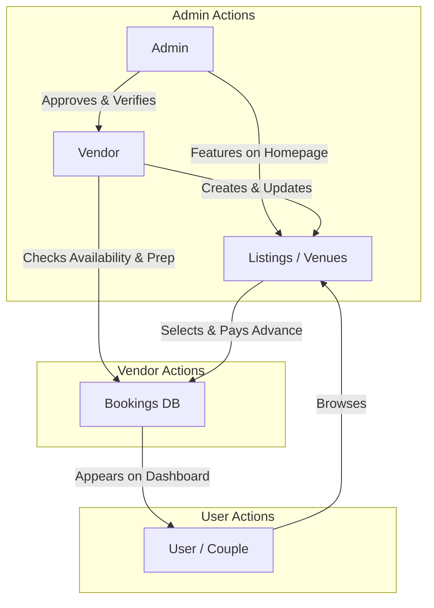

# The SoulsWed Ecosystem: Role-Based Workflows

The platform operates as a three-way ecosystem between **Users (Couples)**, **Vendors**, and **Admins**. Here is exactly how each role functions and how they interact.

---

## 1. The Vendor Flow (The Seller)
Vendors (like Venue Owners, Photographers, Make-up Artists) need to list their services to get booked.

1. **Onboarding**: A new vendor visits `/signup` and selects the "Vendor" role. They provide their `businessName`, `city`, and `categories` (e.g., venues, planners).
2. **Pending State**: By default, their account is created but marked as `verified: false`.
3. **The Vendor Dashboard**: They are redirected to `/vendor/dashboard`. Here they can:
   - Create and manage their Listings/Venues.
   - Upload gallery images and set pricing (e.g., price per plate).
   - Set `unavailableDates` (days they are already booked outside the platform).
4. **Receiving Bookings**: When a user books their venue/service, the vendor receives a notification in their dashboard. 
5. **Managing Bookings**: They can view the user's details, the 30% advance payment status, and the event date to prepare for the service.

---

## 2. The Admin Flow (The Platform Manager)
The Admin is the master controller of the SoulsWed marketplace. They ensure quality and handle disputes.

1. **Admin Login**: The Admin logs in using a secure, hardcoded/database-driven admin account.
2. **The Admin Dashboard**: They access `/admin/dashboard`, which provides a bird's-eye view of the platform.
3. **Vendor Moderation**:
   - The admin reviews new vendors who have signed up.
   - The admin clicks **Verify** (updating `verified: true` in the DB) to show users that this is a trusted vendor.
   - They can also feature vendors/venues (`featured: true`) so they appear on the homepage.
4. **Monitoring Transactions**: Admins can see all bookings across the platform, tracking the total revenue and advance payments processed via Stripe.

---

## 3. The User Flow (The Buyer/Couple)
The Couple uses the platform to seamlessly plan their wedding.

1. **Discovery**: The user browses the site. They see a mix of regular and `featured` venues. They look for the `verified` badge to ensure vendor trustworthiness.
2. **Booking**: Once they find the right vendor, they select dates. If the vendor has marked those dates in `unavailableDates`, the system prevents the booking.
3. **Payment**: The user pays the 30% advance via Stripe. 
4. **The User Dashboard**: After payment, they are taken to `/dashboard`. Here they have a complete itinerary of their wedding:
   - Which venues they booked.
   - Which photographers they hired.
   - Total amount left to pay directly to the vendors on the wedding day.

---

## How it all connects (The Ecosystem Loop)

